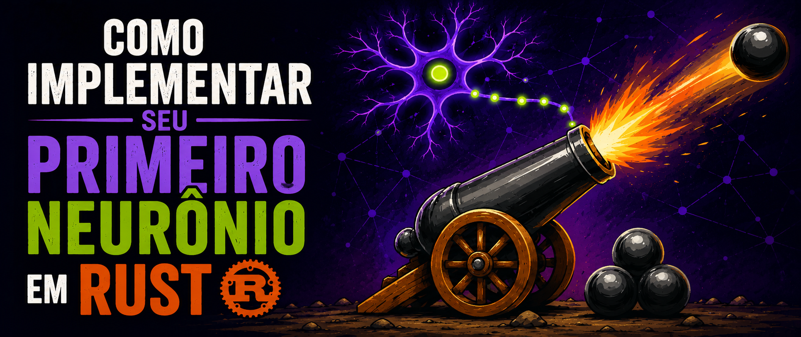
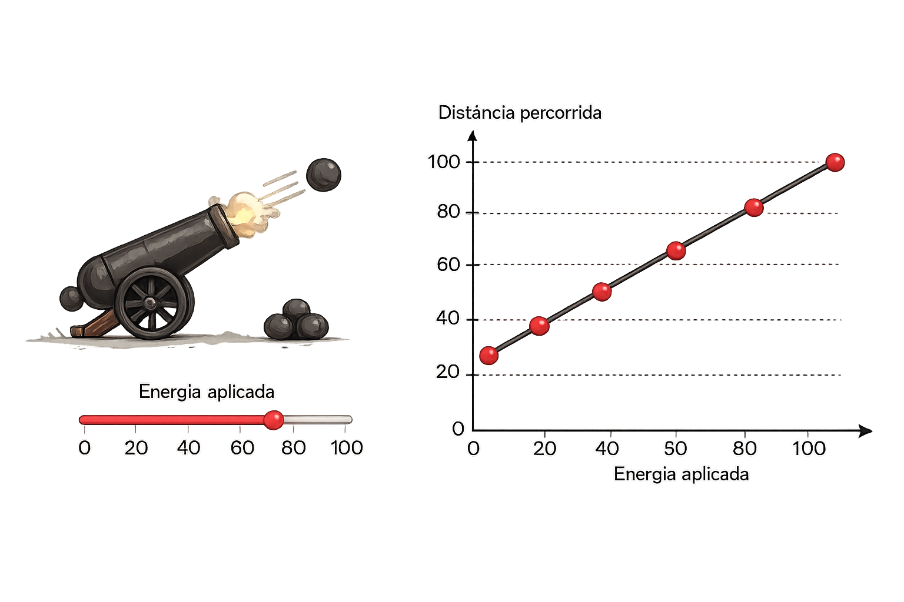
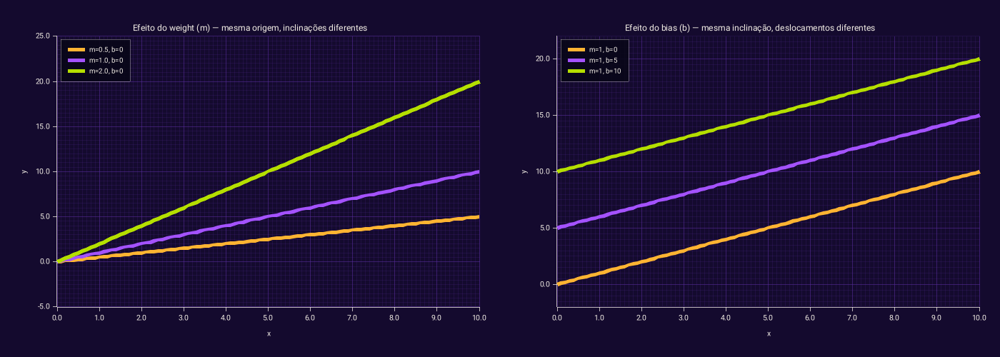
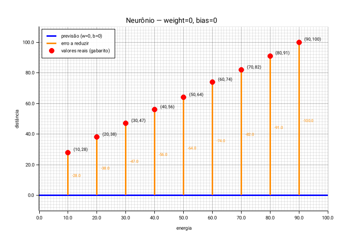
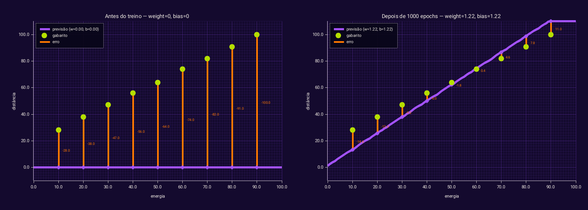

# IA do zero: Implementar seu primeiro neurônio em Rust

<p align="center">
  
</p>

Você já usou o GPT, mas sabe o que existe dentro dele? Neste post implementamos do zero, em Rust, o bloco mais fundamental de qualquer rede neural — um único neurônio.

## Conteúdo

- 1 [Prólogo](#1)
- 2 [O problema](#2)
- 3 [O dataset](#3)
- 4 [y = mx + b — a ferramenta](#4)
- 5 [O neurônio](#5)
- 6 [O erro](#6)
- 7 [O training loop](#7)
- 8 [A limitação](#8)
- 9 [Conclusão](#9)

---

### 1. Prólogo <a name="1"></a>

Tenho usado muita IA ultimamente para escrever código, construir produtos e acompanhar tudo o que está acontecendo na área. E um ponto com o qual sempre concordo é a importância de estudar os fundamentos.

Em algum momento usamos jQuery, depois React, Vue, Svelte, Next, Nuxt, Xupt, Xep e plinbols. Por trás de todas elas, existem conceitos e princípios que permanecem e é nisso que acredito que vale a pena investir tempo tentando compreender.

Imagine um cenário em que algum conhecido não técnico te pergunta como funciona essa tal de IA e você não faz ideia do que responder. Talvez isso nem fizesse tanta diferença, porque provavelmente ele também não entenderia todos os detalhes, mas eu prefiro não correr o risco de passar essa vergonha.

Então resolvi voltar um pouco ao começo: estudar alguns conceitos fundamentais, implementá-los, tomar notas e transformar essas anotações em uma série de posts para compartilhar essa jornada de aprendizado.

Este primeiro post é sobre implementar e treinar um neurônio artificial capaz de aprender uma relação entre uma entrada X e uma saída Y.

---

### 2. O problema <a name="2"></a>

Imagine um canhão que cada vez que ele dispara, você controla a energia do disparo e queremos saber até onde a bala vai chegar.

A pergunta é: dado um valor de energia que nunca usamos antes, conseguimos prever a distância?

```
energia → [ neurônio ] → distância prevista
```

É isso que o neurônio vai aprender — não a partir de uma fórmula, mas a partir dos dados que coletamos.



---

### 3. O dataset <a name="3"></a>

Alguém foi lá e atirou o canhão 9 vezes e a cada disparo, anotou dois números: a energia usada e a distância que a bala percorreu.

```rust
let dataset: Vec<(f64, f64)> = vec![
    (10.0, 28.0),  // energia 10 → bala caiu a 28
    (20.0, 38.0),  // energia 20 → bala caiu a 38
    (30.0, 47.0),
    (40.0, 56.0),
    (50.0, 64.0),
    (60.0, 74.0),
    (70.0, 82.0),
    (80.0, 91.0),
    (90.0, 100.0), // energia 90 → bala caiu a 100
];
```

Cada par é `(energia, distância)` e este é o nosso dataset.

É com esses dados que o neurônio vai aprender, ele nunca vê a fórmula por trás, somente os pares. É como tentar descobrir a receita de um prato apenas provando ele várias vezes.

---

### 4. y = mx + b — a ferramenta <a name="4"></a>

Olhando os dados dá pra perceber: conforme a energia aumenta, a distância aumenta proporcionalmente então podemos descrever esse caso como a equação de uma reta.

`y = mx + b` descreve uma linha reta. Dado qualquer `x`, ela devolve um `y`.

- `m` controla a **inclinação** — a cada 1 unidade que `x` avança, `y` sobe `m` unidades
- `b` controla onde a reta **começa** — onde ela cruza o eixo Y quando `x = 0`



Neste primeiro exemplo, vamos modelar o neurônio como uma transformação linear simples. Em Machine Learning (ML), `m` e `b` ganham nomes diferentes:

- `m` → `weight`
- `b` → `bias`

> Na prática, neurônios em redes mais complexas têm uma função de ativação que introduz curvas e permite aprender padrões não-lineares. Sem ela, combinar vários neurônios ainda resulta numa reta. Mas isso é assunto das fases seguintes — por agora trabalhamos com o neurônio mais simples possível.

---

### 5. O neurônio <a name="5"></a>

Um neurônio artificial, neste contexto, é essa equação aplicada a um problema real.

Para o nosso problema, a tradução fica assim:

```
y = mx + b -> distância = weight * energia + bias
```

Ou seja, `x` vira energia, `y` vira distância, `m` vira `weight` e `b` vira `bias`.

```rust
pub struct Neuron {
    pub weight: f64,
    pub bias: f64,
}

impl Neuron {
    pub fn predict(&self, x: f64) -> f64 {
        self.weight * x + self.bias
    }
}

let neuron = Neuron { weight: 0.0, bias: 0.0 };
```

A função `predict` é literalmente `y = mx + b`, com `weight` e `bias` definidos como zero, pois nosso neurônio ainda não sabe nada.

---

### 6. O erro <a name="6"></a>

Agora que temos nosso neurônio com a função `predict` implementada, além dos parâmetros `weight` e `bias`, precisamos medir o quão boa foi a nossa previsão.

O erro é calculado comparando o valor previsto pelo neurônio com o valor real definido no dataset.

```
y = mx + b
distância = weight × energia + bias

erro = previsão - valor_real
```

```rust
let predicted = neuron.predict(energy);
let error = predicted - actual;
```

Visualmente, o estado inicial é esse:



- **Linha azul** — previsão do neurônio, colada no zero
- **Bolinhas vermelhas** — os valores reais do dataset
- **Linhas laranjas** — o tamanho do erro em cada ponto

O objetivo é ajustar `weight` e `bias` até a linha azul passar por cima das bolinhas e quando as linhas laranjas sumirem, o neurônio aprendeu.

---

### 7. O training loop <a name="7"></a>

Agora que conseguimos calcular o erro, precisamos fazer o neurônio melhorar suas previsões.

O training loop consiste em repetir o mesmo processo várias vezes. Cada passagem completa pelo dataset é chamada de uma `epoch`. A cada `epoch`, vamos ajustando `weight` e `bias` com o objetivo de aproximar a reta dos valores observados.

Para este primeiro exemplo, vamos utilizar uma estratégia bastante simples e totalmente didática, sem ainda entrar em gradient descent ou cálculo de derivadas:

1. Inicializamos weight e bias com valores (0, 0);
2. Para cada par do dataset, por exemplo (10, 28), calculamos o erro da previsão;
3. Se o erro for maior que 0, significa que estamos prevendo um valor maior do que o esperado, então reduzimos weight e bias em 0.01;
4. Se o erro for menor que 0, significa que estamos prevendo um valor menor do que o esperado, então aumentamos weight e bias em 0.01;
5. Repetimos esse processo durante 1000 epochs, tentando calibrar os valores de weight e bias.

```rust
for epoch in 0..epochs {
    for (energy, actual) in dataset {
        let predicted = self.predict(*energy);
        let error = predicted - actual;

        if error > 0.0 {
            self.weight -= 0.01;
            self.bias -= 0.01;
        } else if error < 0.0 {
            self.weight += 0.01;
            self.bias += 0.01;
        }
    }
}
```

Essa regra de ajuste foi escolhida porque é fácil de visualizar: quando o neurônio erra para cima, empurramos os parâmetros para baixo; quando erra para baixo, empurramos para cima. Ela melhora o modelo, mas ainda não é o procedimento mais adequado para treino.

Depois de 1000 epochs:



A reta se ajustou. O neurônio aprendeu alguma coisa.

---

### 8. A limitação <a name="8"></a>

A reta se ajustou, mas não perfeitamente: ela acerta nos pontos do meio e erra mais nas pontas.

O motivo é que esse algoritmo ajusta sempre pelo mesmo passo fixo (`0.01`), sem considerar o **tamanho** do erro, só o sinal. Além disso, ele não usa a inclinação de uma função de perda para decidir a direção e a intensidade ideais do ajuste, então em algum momento começa a oscilar, ultrapassa o valor certo, corrige demais pro outro lado e ultrapassa de novo. Mais epochs não resolve.

O que resolve é o **gradient descent**, outra forma de tentar reduzir o erro que veremos em um próximo post.

---

### 9. Conclusão <a name="9"></a>

Neste post saímos do zero e implementamos um neurônio funcional em Rust.

O que foi aprendido:

- Um neurônio artificial é `y = mx + b` — a equação de uma reta
- `weight` e `bias` são os parâmetros e são ajustados pelo treino
- O dataset é o gabarito e o neurônio aprende olhando exemplos, sem ver a fórmula
- O erro mede o quanto o neurônio está errando em cada ponto
- O training loop usa o erro para ajustar os parâmetros a cada `epoch`

Na prática, o que construímos aqui foi um modelo linear simples treinado com uma regra manual de ajuste e isso já é suficiente para entender a intuição central de previsão, erro e correção, mesmo antes de entrar em outros algoritmos.

O que ainda não resolvemos é que o ajuste pelo sinal do erro é simples demais, não considera o tamanho do erro com precisão e pode causar oscilação.

No próximo post: **gradient descent**, o algoritmo que visa melhorar isso e é uma forte base de todo o aprendizado de máquina moderno.

---

### Referências

- [Neural Network from Scratch — vídeo que inspirou essa série](https://www.youtube.com/watch?v=GkiITbgu0V0&t=477s)
- [Artificial neuron — Wikipedia](https://en.wikipedia.org/wiki/Artificial_neuron)
- [Código-fonte do projeto](https://github.com/z4nder/rs-linear-neuron)

---
